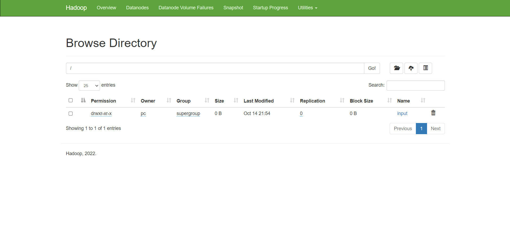
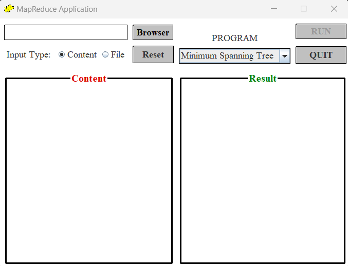
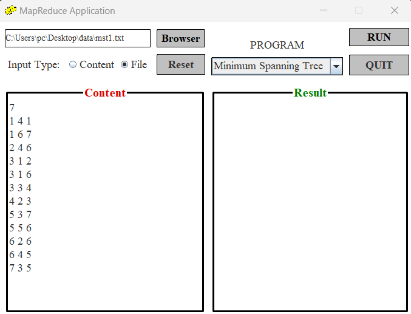
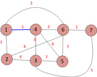
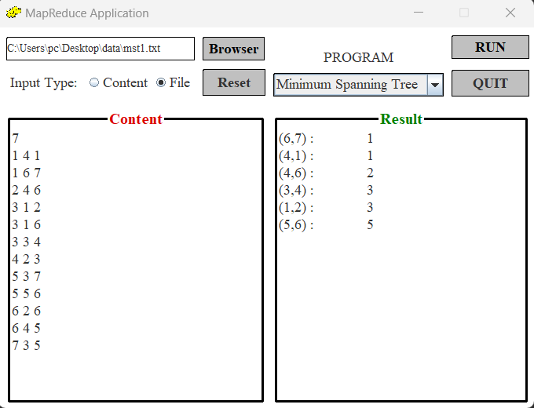
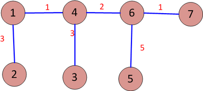

Tên dự án: Ứng Dụng Mô Hình MapReduce 

Mô tả: 
	- Lập Trình Giao Diện 
	- Ngôn ngữ: Java Swing 
	- Dự án: Maven Project 
	- Hiện tại:  
		+ Giải quyết được 2 bài toán Word Count và Minimun Spanning Tree 
	- Tương Lai:  
		+ Tích hợp được nhiều bài toán hơn 
	- Phiên bản:  
		+ Apache Hadoop: 3.2.4 
		+ JDK: 1.8.0_351 

Cài Đặt: Cần thỏa mãn các điều kiện: 
	- Chạy được máy ảo hadoop: (hdfs://localhost:9000/) 
		
	- Cài đúng phiên bản Hadoop & JDK để tránh lỗi tiềm ẩn 
	- Cài Eclipse để sử dụng Project này 

Sử Dụng: Để ý trong file cấu hình xml để kết nối được với hadoop 

Tính Năng: 
	- Đếm số từ 
	- Tìm cây bao trùm nhỏ nhất 

Tác giả: 
	- Lê Xuân Trung - 19PFIEV3 - 123190119 :3 
Liên hệ:
	- SĐT: 0837867773
Sản phẩm:
	 
		 
	 
	 
	 
	 